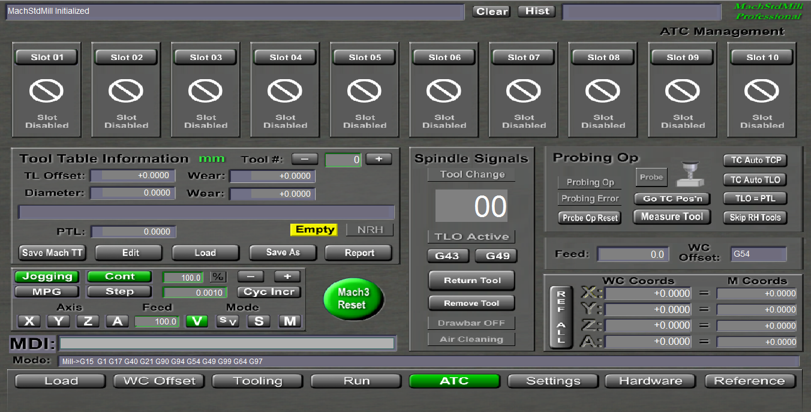
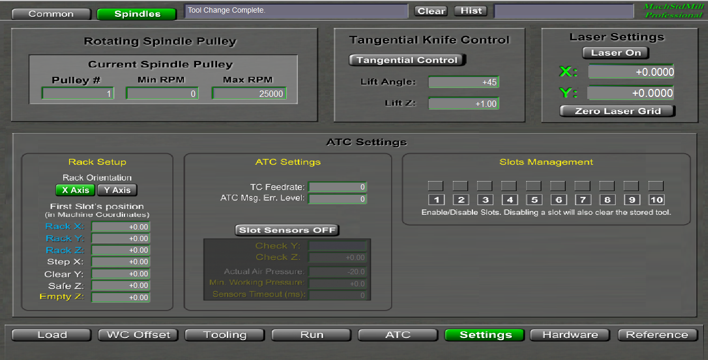
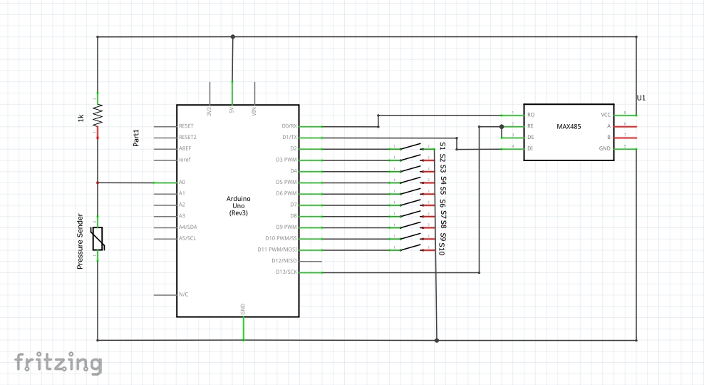
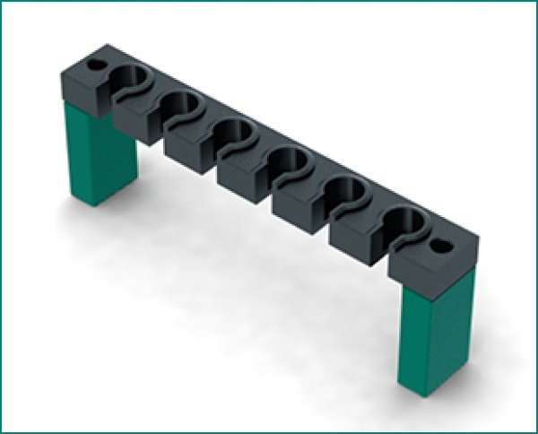

## WORK IN PROGRESS - Use on your risk!
##  = INCOMPLETE DOCUMENTATION =

# Installation of MSM_ATC Screenset

### Prerequisites:
- Mach3
- MachStdMill from Calypso Ventures (MSM_ATC was tested with v2.0.12)
- Home Switches enabled - it is mandatory to have the machine referenced when using ATC system.

1. Download MSM_ATC from here - https://github.com/Haimana/MSM_ATC
2. Extract all files and folders inside your Mach3 installation directory and overwrite all existing files. Some of the needed ATC macros - <i>like M6ATC.m1s, macropump.m1s and so on</i> - will be placed in "macros\MSM_ATC" folder. Move all files found inside this folder into your "macros/profile_folder". It is mandatory to copy at least <i>M6ATC.m1s and macropump.m1s</i> to your "macros/profile_folder". In the same directory "MSM_ATC" you will find more files: <i>M606, M1000 and Modbus.cfg</i>. These files will be explaind later, for now are not required.
3. Start Mach3 and make sure you have "Auto Tool Changer" option selected and "Run Macro Pump" option is enabled. 
4. If you just enabled the use of macropump you have to restart Mach3
5. Go to MachStdMill/Settings page and press the "Load Screen" button. Load the "MSM_ATC.set" screenset from MachStdMill\Set Files\Custom folder. DO NOT LOAD this screenset directly from Mach3\View\Load Screen menu.
6. If everything is OK you should have now a customized MachStdScreen with the USER page renamed to ATC and a modified Settings/Spindles page where ATC system have to be configured, like bellow:

 
### Configuration of MSM_ATC
- Access ATC settings page by clicking on the "ATC Management" label located at the right-upper side of ATC Page
- MSM_ATC is able to work with fixed racks aligned on X or Y Axis. Select the desired axis in Settings/Spindles page. After changing it a  the labels should switch from Step X to Step Y and from Clear Y to Clear X, or vice versa, if Y axis was previously selected.
- First time we have to declare the first slot's position. This is the position where the first slot's tool is load or released. Set it by filling Rack X, Rack Y and Rack Z fields. All values have to be in Machine Coordinates only!
- If the rack is built with holding forks, the tool have to be removed from or returned to the fork by an additional movement along Y-Axis (if rack is aligned along X-Axis). The Y-Axis position from where this additional movement is starting or ending is called Clear Y (or Clear X for Y-Axis aligned rack). Set the Clear Y (or Clear X for Y-Axis aligned rack) field as an Y-Axis (or X-Axis) position where the tool can be clearly moved up or down, in front of slot's forks.
- If this additional movement is not needed just set Clear Y (Clear X) with the same value with Rack Y (Rack X, for Y-Axis aligned rack). In this case the tool will be loaded or returned only by a vertical movement along Z-Axis. 
-  Step X (Step Y, for X-Axis aligned rack) is the distance between each adjacent slots of the rack, along X Axis (or Y Axis).
-  Safe Z is the Z-Axis position where the spindle is raised when ATC operations occur.
-  MSM_ATC can handle reporting status sensors for each slot of the rack. By default, the slot sensors are disabled and the system is running in blind mode. 
-  Empty Z - USE WITH CAUTION! - will allow the machine to move above tool holders at a different Z axis position when the spindle does not have tool loaded (when empty spindle). This is helpful for long Z-Axis machines and prevent the return to Safe Z when the spindle is empty and can travel at a lower Z-Axis position when empty. To disable this intermediary position, just set Empty Z as the same value with Safe Z.
-  TC Feedrate is the speed for ATC operations.
-  ATC Msg. Err. Level - is the level of reported ATC messages. For debugging set a higher value, like 5, which will report any ATC operation. For regular run, set this level at 1 or 2, only basic operation is reported.

### Slot Sensors
- MSM_ATC can handle slot sensors. The sensors status have to be passed to OEM Trig #1 - #10 inputs. Because Mach3 alone cannot handle more than 2 parallel ports, a different way for passing slot's sensors status could be an Arduino board which communicate with Mach3 through Modbus protocol and some brains.
- The Arduino code can be found in _Doc folder and was tested with Arduino Uno and Mega 2560. It will require a serial modbus communication device installed and configured for Mach3.
- The schematic:   S1-S10 are NO switches. When tool is in slot the switch is closed. A and B pins are connected to the Modbus. Make sure the Arduino board will be properly powered.
- For reading slot sensors status a brain is required. I made a brain which can be found in "Brains" folder. This brain - arduino_modbus_oemtrigs.brn - have to be enabled in Mach3/Operator/Brain Control menu.
- If Mach3 is running with some motion controller, like UCCNC, which provide more inputs pins, the Ardunio board is not required. Just config OEM Trig #1 to #10 to physical inputs. The brain will not be also required.
- Check Z (and Check Y/Check X, soon) is an additional position where the system will move (after the oldtool was released or after the newtool was loaded) for checking for slot's status (slot have tool, slot have no tool). These additional positions depends on the rack's design. For a simple rack - like below - where toolholders can be loaded or retrieved by a vertical movement, the Check Z position should be few milimeters above Rack Z. When a tool is returned into a slot, after releasing, the system will move to Check Z position and there will check the slot status, which should report tool's presence. Same, when a tool is loaded into the spindle, after loading, the system will move into Check Z position and chesk the slot status which have to report no tool in slot (because the tool should be already loaded in spindle). If Check Z is equal with Rack Z the system will check these sensors at Rack Z position. So, if no additional movements are required before checking slot sensors, set Check Z = Rack Z. Same rules will be applied for Check Y/Check X in the next version.
 

- Sensors Timeout - this is a delay used when checking for slot sensor's status. In some condition, the status is delayed and this waiting time is required. If sensors use is enabled and checked, after this delay the system report the error (if still in error condition) and give to the operator the possibility to abort, recheck or ignore the sensor's status inside ATC operations. Use the "Ignore" option just when you are sure the sensor's reported status is wrong and is safe for the machine to run.
- Actual Air Pressure is the air pressure reported by Arduino Sensors (if available). This is a readonly value.
- Min. Working Pressure is the minimum working pressure for properly ATC operations. If no air pressure or nor Arduino Sensors Board available, set it equal or lower (even negative values are allowed) with Actual Air Pressure.
- Slots Management - By default all 10 slots are disabled. You have to enable all the needed (available) slots you want to use. If needed, each slot can be enabled/disabled individually.
- Disabling a slot will also remove it's previously loaded tool. Re-enabling a slot will enable it as an empty slot. 
